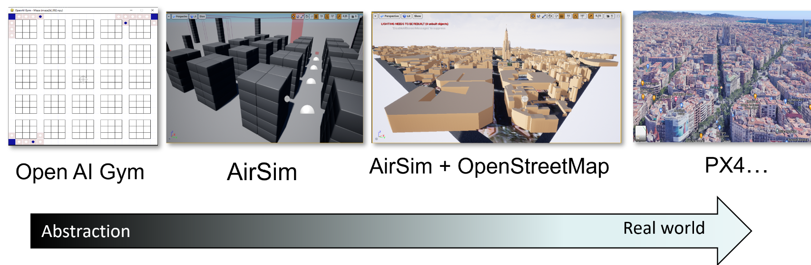

# Multiple Abstraction Layers Reinforcement Learning (MALRL)
[Multiple Abstraction Layers Reinforcement Learning (MALRL)](https://sites.google.com/view/malrl-framework/home-page) is a framework developed as final project for Master Thesis in Engineering in Computer Science, at Sapienza University of Rome, supervised by Prof. [Luca Iocchi](https://www.diag.uniroma1.it/users/luca_iocchi).

The scope of MALRL is to generate 3D realistic trajectories for a scenario of multiple UAVs flying inside a fixed portion of space, in a grid pattern. 
Each UAV moves from a random point A to a different random point B (both points not over obstacles). 
Horizontal and vertical separation is enforced to simulate a collision risk miminimazation system. 



MALRL is composed of three main layers, each one executable independently:
1) Grid Layer (GL) -> layer1.py
   - 2D QLearning in a grid maze 
   - Maze based (scale 1:40) on abstraction from real world scenario
   - Horizontal separation enforced for UAV groups/total 
   - Vertical separation to generate 3D data 

2) Simplified 3D Layer (S3DL) -> layer2.py
   - 3D simulated data using AirSim
   - UAV following trajectories from previous layer
   - Simulation executed iteratively (one UAV/traj at the time)
   - Kinematic data in output (velocity, acc, orientation)
   - Real time collision detection (UAV-building, UAV-surface)

3) Georeferenced 3D Layer (G3DL) -> layer3.py
   - 3D simulated data using AirSim
   - Similar structure of previous layer
   - Plot of trajectory to be followed
   - Introduction of GPS (simulated) data exploiting OpenStreet map georeferenciation (case of study: Barcelona,Spain)

The output of each layer is used as input for the following layer. Eventually is possible to give a specific input (set of trajectories) to a single layer.


The second and third layers (layer2.py, layer3.py) are based on **custom AirSim environments** free [downloadable](#Environments) from the links at bottom page. 


layer1.py             | layer2.py             |  layer3.py
:-------------------------:|:-------------------------:|:-------------------------:
  |   |  
OpenAI Gym                 | AirSim                   | AirSim + OpenStreetMap


At the end it will be possible to have CSV files in output containing trajectories coordinates, kinematics info, GPS coordinates (gps only for layer 3).


# Install
1. Clone the repository
2. Install Anaconda with Python 3.6
3. Install Unreal Engine
4. Intall AirSim  
    
Only Layer 2 (layer2.py) and Layer 3 (layer3.py) require Unreal Engine 4 (UE4) started and AirSim plugin installed.

## Anaconda install
Anaconda has been used to create an environment isolating the project from different versions of Python and/or different version of packages.

Anaconda install instructions, **choose Anaconda for Python 3.6** (the only tested):
- [Install on Windows](https://docs.anaconda.com/anaconda/install/windows/)
- [Install on Linux](https://docs.anaconda.com/anaconda/install/linux/)

Once Anaconda is installed create new environment from file. 

For Windows:

```console
conda env create -f envWindows.yaml
```
For Linux:
```console
conda env create -f envLinux.yaml
```


## UE4 Install (Windows)
**Use of Unreal Engine on Windows is recommended (editing and testing has been done on Windows 10).**
 
1. [Download](https://www.unrealengine.com/download) the Epic Games Launcher. 
2. [Register Epic Games account](https://www.epicgames.com/id/register) (while the Unreal Engine is open source and free to download, registration is still required).
3. Run the Epic Games Launcher:
   - open the Unreal Engine tab on the left pane. 
   - Click on the Install button on the top right, which should show the option to download Unreal Engine >= 4.25. 
   - Choose the install location to suit your needs, as shown in the images below. If you have multiple versions of Unreal installed then make sure the version you are using is set to current by clicking down arrow next to the Launch button for the version.

Note: AirSim also works with UE >= 4.24, however, it's **recommended 4.25**. Note: If you have UE 4.16 or older projects, please see the upgrade guide to upgrade your projects

## UE4 Install (Ubuntu)
To install AirSim on Ubuntu follow the instructions at: 
https://www.unrealengine.com/en-US/ue4-on-github

In a nutshell you will need to:
1) Clone UA4 repo
2) Build
3) Run UA4 (Setup.sh)

## Environments download
Environments are available as open source, editable projects at the following links:
- [Click here to download Layer2 from Drive](https://drive.google.com/drive/folders/1754p_qQnguh83av8yTdc0yW9a_EnuZmJ?usp=sharing)
- [Click here to download Layer3 from Drive](https://drive.google.com/drive/folders/17a_t73zrxV6WmlYNmlWtj8eyTNHARFcs?usp=sharing)

## AirSim install
AirSim instructions can be found in the doc:
- [Install on Windows](https://microsoft.github.io/AirSim/build_windows/)
- [Install on Linux](https://microsoft.github.io/AirSim/build_linux/)

Once succesfully installed AirSim, you will need to replace [AirSim settings](https://microsoft.github.io/AirSim/settings/) at their location, with the one you can find at:
src/settings.json 

# Usage
The project makes use of 2D and 3D maps built upon use case scenario (Barcelona city centre), however it is possible to customize the 2D map present in layer1.py and to crete custom environments inside AirSim.

**To modify parameters** regarading general options or specific to the training/flight phase you can change parameters value inside the **configuration file**. 

**N.B.** Take a look at section [Notes](#Notes) to avoid mistakes when changing parameters.

Configuration file can be found at: **src\inputData\config.yaml**

Once config parameters are all set, you can start running:
To run MALRL first make sured to be inside \src:
```console
cd src 
```
Then start executing layers one by one in the following order:

1) [Run Grid Layer](#Run-Grid-Layer-(layer1.py))
2) [Run Simplified 3D Layer](#Run-Simplified-3D-Layer-(layer2.py))
3) [Run Georeferenced 3D Layer](#Run-Georeferenced-3D-Layer-(layer3.py))

## Run Grid Layer (layer1.py)
To run the first layer you can launch in the previously set conda environment:
```console
python layer1.py 
```
Optional arguments:
   | Argument | Explanation|
   |--------------|----------|
   | --nepisodes | Number of episodes|
   | --ntrajs | Number of trajectories to be generated|
   | --nbuffer | Size of buffer for max number of past trajectories to avoid (then is flushed
   | --nsteps | Enforce n-steps qlearning, if 0 then standard qlearning |
   | --debug | Log debug in file |
   | --render-train | Render maze while training/random  |
   | --render-test | Render maze while testing |
   | --quiet | Less info in output mode on  |
   | -v | Verbose mode on |
   | --slow | Slow down training to observe behaviour|
   | --log-reward | Log reward file in out|
   | --load-qtable | load qtable file specified |
   | --show-maze-bm | Show Bitmap used as maze|
   | --random-goal-pos | Choose random start pos instead of the one inside csv file|
   | --generate-random-start | Choose random start pos instead of the one inside csv file|
   | --random-start-pos | Choose random goal pos instead of the one inside csv file |
   | --generate-random-goal | Choose random goal pos instead of the one inside csv file |
   | --generate-maze | Generate new maze structure (rows and cols inside config.yaml) |

## Run Simplified 3D Layer (layer2.py)
```console
python layer2.py 
```
## Run Georeferenced 3D Layer (layer3.py)
```console
python layer3.py 
```
# Create new scenarios (*optional)

## Generate new 2D grid
Standard maze file is the one studied upon Barcelona city centre.

To generate a new mazefile use:
```console
python3 layer1.py generate-maze <mazeFilename>
```
The argument generate-maze will generate a new maze file (2D bitmap of the scenario to be displayed as a grid maze), using values of  
- NROWS -> Number of rows of the grid
- NCOLS -> Number of columns of the grid
- OBS_BLOCKS -> Number of blocks composing edges of square obstacles
- STD_MAZE -> Filename of the file used in layer1.py

## Create custom Unreal environments 
If you have previously chosen to create a new 2D grid wrt the standard one, you should also create new 3D Unreal environments, both simplified and georefenced one.  

You should follow [these instructions](https://microsoft.github.io/AirSim/unreal_custenv/), they are enough to build your custom simplified environment (used in layer2.py).

For the georeferenced environment you will need an extra step which is the integration of the 3D map with openstreetmap data.
 


# HW Configuration
To run smoothly Unreal Engine the use of a dedicated GPU is strongly recommended. 
For developing and testing a desktop computer with the following specs has been used:

- Intel(R) Core(TM) i5-6400 CPU @ 2.70GHz   2.71 GHz
- Nvidia GTX 970 GAMING 4 GB 
- RAM: 16 GB DDR4
- Samsung SSD 860 EVO 500GB


# Other Info

## Files
inputData\ : folder containing files to set (settings,initial positions for UAVs, final positions for UAVs)
envs\my_maze_generator.py : let you generate custom mazes
layer1.py, layer2.py, layer3.py  : Layers to be executed 
trajs_utils.py : contains useful API functions called in layer modules
malrl_utils.py : contains helper functions
gym_maze\envs\maze_env.py : Class of the custom maze environment
eurocontrolConverter.py : Python script to convert 3d trajectories into format usable for Bubbles collision measurements


## Notes
- Time to generate a trajectories in layer two and three depends on clockspeed value.
- Vehicle used in Airsim has single name: "Drone0" (it is not guaranteed to function any other name).
- All drone names inside MALRL **NEED** to be in this format: "Drone<i>" where i is a number. E.g.: 'Drone0', 'Drone1', 'Drone2', 'Drone3', ...
- N_TRAJECTORIES_TO_GENERATE (or --ntrajs if used) should be a multiple of TRAJECTORIES_BUFFER_SIZE for the sake of simplicity.

<!-- ## Windowed env launch (Windows 10 AirSim)
To run Airsim windowed:
$ Blocks.exe -WINDOWED -ResX=640 -ResY=480 -->

## Useful shortcuts (AirSim)
F8 to toggle Unreal free mode (very useful to explore the environment while simulating e.g. looking from above) 
' per debug
F2 to toggle rendering


## AirSim demo files 
The following is a list of demo python scripts and their explanation, taken from [AirSim](https://github.com/microsoft/AirSim/tree/master/PythonClient), ready to be run after installation **to test airsim possibilities**.

Multirotor demo files:
- arm.py -> No visual effect (simple arming drone)
- box.py -> Flying on a small square box path using moveByVelocityZ
- clock_speed.py -> See how to change clockspeed in settings
- disarm.py -> No visual effect (simple disarming drone)
- DQNdrone.py -> HOW TO DQN
- drone_lidar.py -> Get Lidar (simulated) data from a drone
- drone_stress_test.py -> Move order and reset reapeatedly in small time interval (stress test)
- gimbal.py -> Move camera like with a gimbal
- hello_drone.py -> Simple operations
- high_res_camera.py -> Use scene image request + settings to get high res images
- kinect_publisher.py -> Uses kinect in some way (more for ROS)
- land.py -> Launch land movement and then set land state  
- manual_mode_demo.py -> Get commands by radio-controller
- multi_agent_drone.py -> Snap photos by multi uav
- navigate.py -> Use open cv to show new images from AirSim 
- opencv_show.py -> test computer vision mode ( it requires settings mod in order to work) 
- orbit.py -> Make the drone fly in a circle
- params.txt -> PX4 parameters
- path.py -> This script is designed to fly on the streets of the Neighborhood environment follows a opath specifyed by 3d vectors
- pause_continue_drone.py -> Pause and start
- point_cloud.py -> To create point cloud using opencv
- reset_test_drone.py -> Fly, reset, fly
- set_trace_line.py -> Draw line and fly
- set_wind.py -> Set wind values
- state.py -> Check ready state, print ready message
- survey.py -> Fly over a box to survey it
- takeoff.py -> Useless
- teleport.py -> Teleport drones in another position


Environment demo files:
- set_wind.py -> Set wind with directions
- unreal_console_commands.py -> Run cmd onto unreal cmd
- weather.py -> Change weather conditions


# Sources
- https://github.com/Kjell-K/AirGym
- https://github.com/koulanurag/ma-gym
- gym-airsim

For other sources and insipiration take a look at my watch/star list.
